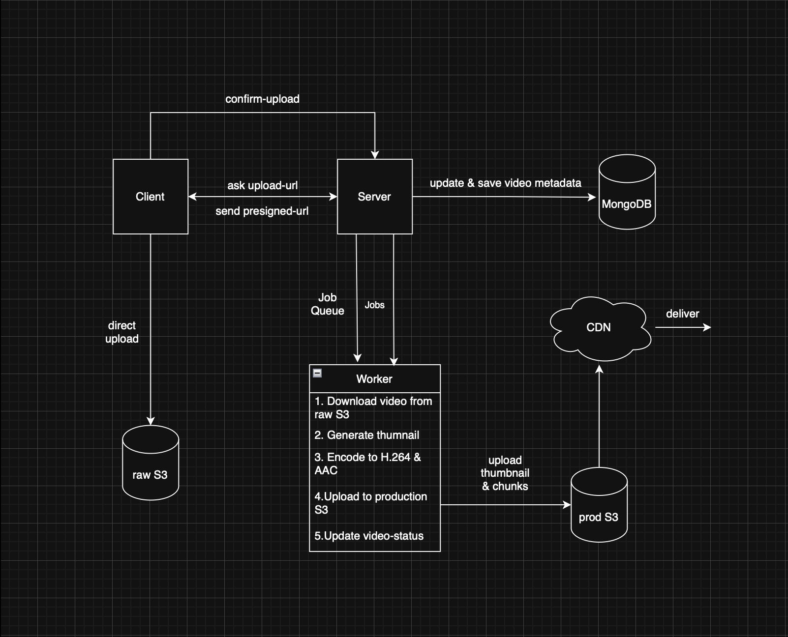

# Video Processing Worker

A distributed video processing worker built in Go.

Consumes background jobs from Asynq, downloads uploaded videos from Amazon S3, transcodes them into adaptive HLS renditions using FFmpeg, generates thumbnails and master playlists, uploads processed assets back to S3, cleans up raw media, and notifies the API when processing completes.

---

## Tech Stack

- Go
- FFmpeg
- Asynq
- Redis
- Amazon S3
- Docker

---

## Features

- Asynchronous background job processing
- Adaptive HLS transcoding (1080p, 720p, 480p)
- Parallel transcoding using goroutines
- Configurable concurrency with semaphores
- Automatic thumbnail generation
- Master playlist generation
- Recursive upload of processed assets to Amazon S3
- Automatic cleanup of raw videos after successful processing
- Temporary workspace management & cleanup
- API callback after successful processing
- Dockerized for deployment
